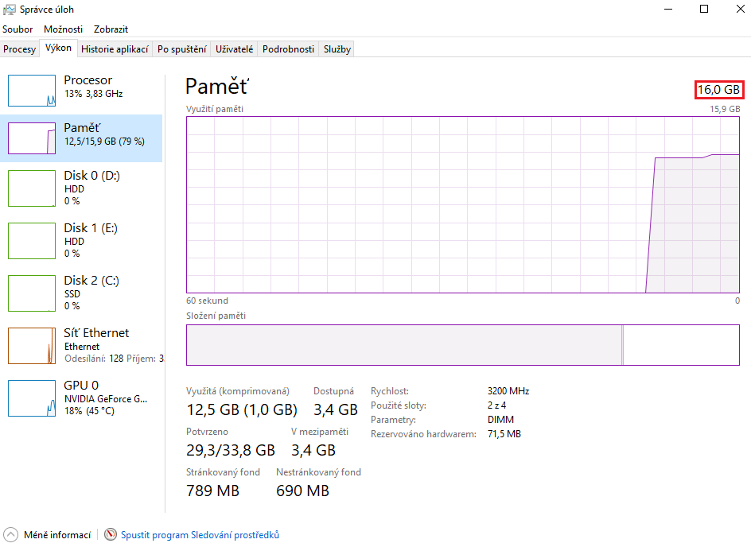

# 0 - FPS Report
> ⚠️ **Varování:** Pokud hru testujete na notebooku, mějte ho, prosím, připojený k napájení. Alternativně se ujistěte, že nemáte v rámci úspory baterie omezený výkon.

## 1. Stažení hry
Hra je k dostání na [Google Disku](https://drive.google.com/file/d/1woxq1I0nIReDquTIzgc1BW-eeLqQle4a/view?usp=sharing). Hru si prosím stáhněte a archiv extrahujte na libovolné místo.

## 2. Spuštění hry
Spusťte soubor „*TULtimátní hra.exe*“. Ničeho se nebojte, soubor je nezávadný a případná varování Windows prosím ignorujte.

> ⚠️ **Varování:** Nejedná se o plnou verzi hry, nejspíše narazíte na chyby. Nyní jde však pouze o průzkum průměrné hodnoty FPS.

## 3. Zapnutí FPS
Po spuštění hry přejděte do nastavení a zaškrtněte „Ukazatel FPS“. Po zaškrtnutí byste měli vidět v levém horním roku hodnotu FPS.
**Nezapomeňte kliknout na tlačítko „Uložit“!**

> ⚠️ **Varování:** Během sběru hodnot FPS ze hry „nepřeklikávejte“ ani nepoužívejte zkratky ALT + TAB. Narušilo by to integritu testování.

## 4. Vypnutí hry
Po zapnutí logování FPS hru vypněte (ať už v hlavním menu nebo pomocí ALT + F4), aby se nám resetovaly logy.

Potom hru znovu zapnětě.

## 5. Získávání hodnot FPS
Po spuštění hry zůstaňte chvilku (~20 vteřin) v menu, poté se překlikněte do nastavení a počkejte tu podobnou dobu (**Nevypínejte ukazatel FPS ani nezapínejte VSync!**).

Poté v hlavní nabídce kliknětě na *Nová hra*. Objevíte se v lobby. Pomocí kláves WSAD se přesuňte po cestě k levému kraji scény (černá šipka ukazuje směr). Po dosažení levého okraje se objevíte u druhé budovy. Vkročte do dveří, na které ukazuje šipka.

Po vkročení do dveří budovy G se objevíte v herním levelu. Zde zůstaňte aspoň jednu minutu. Můžete se pohybovat pomocí WSAD, když spadnete z mapy, nic se nestane.

Po jedné minutě můžete hru pomocí ALT + F4 ukončit (ještě nemám menu na návrat to lobby).

## 6. Získání logovacích souborů
Nyní jděte do složky *%AppData%*, konkrétně do složky *LocalLow*. Zde byste měli vidět složku *FM TUL Smutny Strecanska* a v ní *TULtimátní hra*. 

Uvnitř této složky najdete několik souborů. Nás zajímá soubor *Player.log*, který nahrajete do Google Forms.

# Odeslání dat pomocí Google Forms
Odeslání logu probíhá přes [Google Forms formulář](https://docs.google.com/forms/d/e/1FAIpQLSfzvEbe9xRhHP0v4o4H3RiL3zle9bcdWONI3WErtF5CZ7aDdQ/viewform?usp=dialog).

Vyplňte Vaše jméno a příjmení, dnešní datum, dále konfiguraci Vašeho PC.
Nejjednodušší cesta, jak získat požadovaná data, je použít Správce úloh (konkrétní pozice tlačítek se může lišit v závislosti na operačním systému):
1. Otevřete Správce úloh pomocí klávesové zkratky CTRL + ALT + DELETE.
2. Zapněte rozšíření režim Správce úloh.

3. V horní kartě se překlikněte na sekci *Výkon* a potom na položku *Procesor*.
4. Do kolonky *CPU* v Google Docs přepište hodnotu v pravém horním rohu.

5. Překlikněte se do sekce *Paměť* a odtud zkopírujte velikost rychlost paměti.

6. Z kolonky *GPU* poté vložte název grafické garty (máte-li dvě, vložte do Google Forms obě)

Verzi zvolte „Aplha Build“ a testovací scénář „0 - FPS Report“. Do souborů prosím nahrajte Váš *Player.log* soubor.
Moc Vám děkuji za pomoc!
