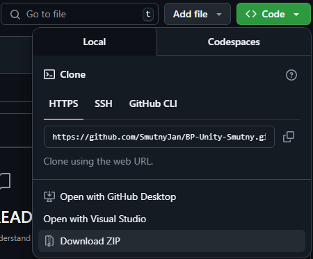
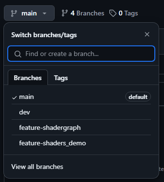
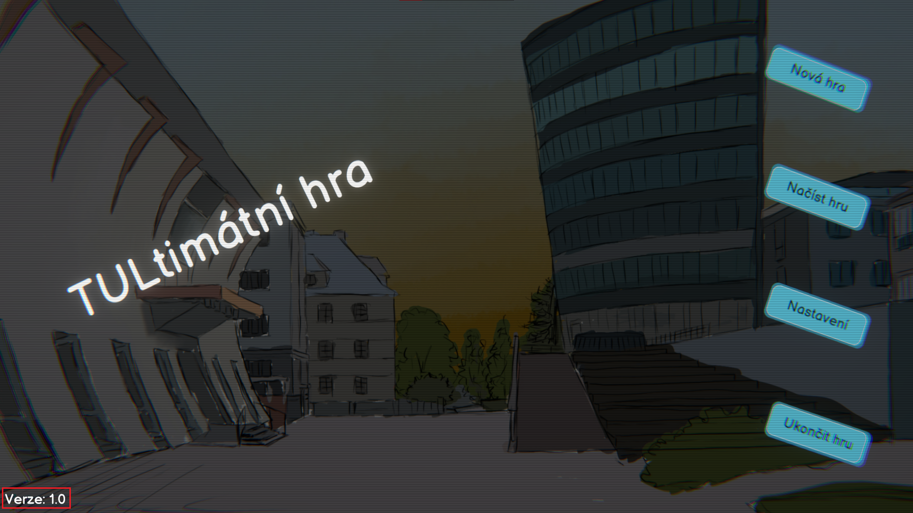

# TULtimární hra - příručka pro testery

# Jak začít?
## Minimální systémové požadavky pro testování
- Operační systém: Windows 10
- Procesor: Intel Core i5-8350U, AMD Ryzen 5 2500U
- Operační paměť: 4 GB
- Grafická karta: NVIDIA GeForce MX110, AMD Radeon 530
- Volné místo na disku: 165 MB

## Spuštění hry
1. Z [GitHub repozitáře](https://github.com/SmutnyJan/BP-Unity-Smutny/tree/main) si stáhněte kopii ve formátu ZIP.

> ⚠️ **Upozornění:** Ujistěte se, že se nacházíte na větvi „main“, která obsahuje aktuální plnou verzi hry.

2. Soubor ZIP vybalte do libovolného adresáře (například „Plocha“ pro snadný přístup).
3. Ve vybalené složce se nachází složka *BP-UnityGame*, soubor *avg_fps.py* a složka *Build*. Ve složce *Build* je soubor *TULtimátní hra.exe*, což je spustitelná hra.
4. Spusťte soubor *TULtimátní hra.exe*. Zobrazí se hlavní menu a díky prvotnímu spuštění se vygenerují i debug logy. Hru nyní vypnětě pomocí tlačítka *Ukončit*.

## Otevření složky s debug logy a herními savy
K pohodlnému testování je potřeba otevřít složku, ve které se nachází debug logy (je nutné je příkládat ke Google formulářům, přes které se odesílají informace o nalezených chybách) a herní savy (představují fázi hry, ve které se hráč nachází), které se budou u jednotlivých testovacích scénářů měnit na předdefinované hodnoty pro rychlejší testování.

Tuto složku lze najít na *C:\Users\{jméno uživatele}\AppData\LocalLow\FM TUL Smutny Strecanska\TULtimátní hra*.
1. Pro zobrazení složky s herními savy nejprve otevřete složku *AppData* (nejsnadnější způsob je vyhledat „%AppData%“ pomocí vyhledávání Windows 10/11).
2. Ve složce *AppData* vyberte *LocalLow*, dále *FM TUL Smutny Strecanska* a *TULtimátní hra*. Tato složka obsahuje soubory *Player.log*, *progress.json*, *settings.json* (za předpokladu, že hra byla alespoň jednou zapnuta).
> ⚠️ **Upozornění:** Po potvrzení volby „%AppData%“ ve vyhledávači se otevře složka *Roaming*, která je potomkem složky *AppData*. Je tedy potřeba „jít“ o jednu složkovou úroveň výše.

## Další kroky
Nyní spusťte *TULtimátní hra.exe* a hru dohrajte (v menu stiskněte tlačítko *Nová hra* a pokračujte v hraní až do závěrečných titulků). Hru není nutno dohrát na jedno zapnutí. Herní postup je v průběhu hraní ukládán.
> ⚠️ **Upozornění:** Pokud během hraní narazíte na jakékoliv neočekávané chování a nebo chybu, která Vám brání v pokračování, fázi prvotního dohrání ukončete.

# Průběh testování
Testování probíhá formou plnění předem definovaných testovacích scénářů. Každý scénář obsahuje přesný popis toho, co se od testera očekává, jaké situace má vyzkoušet a jaký by měl být očekávaný výstup.

Součástí scénáře může být i uložený herní stav ve formátu JSON. Tento JSON je třeba zkopírovat a **před zapnutím hry** ním přepsat obsah souboru *progress.json*. Díky tomu je možné test provádět vždy za stejných podmínek, což zajišťuje konzistentní výsledky napříč různými testery.

## Pojmy
V některých scénářích je také přiložený herní stav ve formátu JSON. V takovém případě je potřeba otevřít soubor *progress.json* ve složce s debug logy a jeho obsah nahradit daty uvedenými u daného scénáře. Tím se zajistí, že testování probíhá vždy ve stejném výchozím stavu.

[Slovník pojmů](./Pojmy.md)

## Kategorizace chyb dle závažnosti
### Neintuitivní chování
- Nejedná se o bug, ale chování je neočekávané.
- **Příklady:**
  - Hráč by nečekal, že když v testu nezaškrtne žádné políčko a dá „Odeslat“, tak se test odešle.
  - Cutscény lze přeskočit i pomocí kláves `E` nebo `NUM ENTER`.
  - Po použití všech kusů daného předmětu předmět z inventáře zmizí.

### Lehká chyba
- Hráč může pokračovat ve hře, ale bug lehce narušuje hratelnost.
- **Příklady:**
  - Hráč se krátce zasekne v textuře.
  - Tlačítko reaguje až na druhé kliknutí.
  - Hráč se nemůže hýbat, pokud ale vyskočí, hybat se může.

### Těžká chyba
- Hráč nemůže pokračovat, narušuje hratelnost, ale hra stále běží (nespadla).
- **Příklady:**
  - Hráč se nemůže dostat z levelu.
  - Tlačítko nereaguje na stisknutí.
  - Hráč může používat neomezené množství itemů.
  - Hra se neukládá.
  - Přestala hrát hudba.

### Kritická chyba
- Hra spadne
- **Příklady:**
  - Hráč použije item a hra spadne.
  - Hráč klikne na tlačítko a hra spadne.

## Zprávy o chybách a o úspěšném testování
V průběhu plnění testovacího scénáře mohou nastat dva případy:
- Scénář končí přesně definovaným očekávaným výstupem. Následně vyplňte *Protokol o úspěchu testovacího scénáře*.
- Scénář se nepovede dokončit z důvodu jakékoliv z výše popsaných chyb. Následně vyplňte *Protokol o chybě*.

### Protokol o úspěchu testovacího scénáře
Formulář [zde](https://forms.gle/h2ScRxJ8PcTQHiRw8).
- **Kolonky:**
  - Jméno testera
  - Přijmení testera
  - Datum testování
  - Verze
  - Testovací scénář
  - Přílohy (debug logy)

### Protokol o chybě
Formulář [zde](https://forms.gle/y7WAztFuzfxBB5s16).
- **Kolonky:**
  - Jméno testera
  - Přijmení testera
  - Datum testování
  - Verze
  - Testovací scénář
  - Typ chyby
  - Popis chyby
  - Postup reprodukce chyby
  - Přílohy (debug logy)  

Verzi lze zjistit na úvodní obrazovce menu:

Do příloh vždy nahrajte soubor *Player.log*.
> ⚠️ **Upozornění:** Před nahráním souboru *Player.log* hru vždy vypněte, aby se předešlo tomu, že nahrajete do formuláře zastaralý nebo nekompletní log.

# Testovací scénáře
Pořadí vykonávání scénářů je irelevantní a záleží pouze na vašich preferencích (co vás baví testovat a co nikoliv). Testy jsou pro lepší přehlednost rozděleny do tématických skupin podle toho, co přesně se ve scénáři testuje:

## Testování výkonu

## Výkon
### [Měření FPS](./scenare/FPS/Měření%20FPS.md)
## Hlavní menu
### [Základní funkcionalita menu](./scenare/hlavni%20menu/Základní%20funkcionalita%20menu.md)

