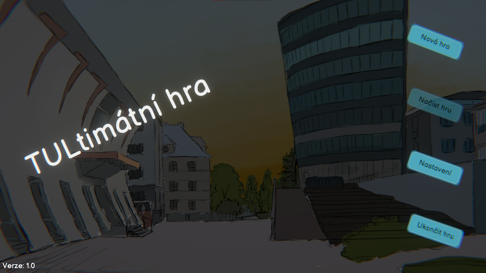

# Základní funkcionalita menu
## Herní stav:
Následujícími hodnotami nahraďte obsah souboru *progress.json* („*CTRK + A -> CTRL + V*“):
```json
{
    "SpawnScene": 0,
    "GameState": 0,
    "Money": 1000,
    "Items": [
        {
            "ItemType": 0,
            "Amount": 5
        },
        {
            "ItemType": 1,
            "Amount": 50
        },
        {
            "ItemType": 2,
            "Amount": 10
        },
        {
            "ItemType": 3,
            "Amount": 10
        },
        {
            "ItemType": 4,
            "Amount": 10
        },
        {
            "ItemType": 5,
            "Amount": 10
        }
    ],
    "LevelConfig": {
        "Scene": 0,
        "SpawnPoint": {
            "x": 0.0,
            "y": 0.0,
            "z": 0.0
        },
        "ChestsOpenedIndexes": [],
        "ItemsRevert": []
    }
}
```

## Popis testovacího scénáře
1. Po spuštění hry se objeví hlavní menu, které vypadá takto (číslo verze se může lišit):


2. Tlačítko „Načíst hru“ je deaktivované a kliknutí na něj nevytváří žádnou vizuální ani zvukovou zpětnou vazbu.

3. Nápis „TULtimátní hra“ pulsuje (zvětšuje se a změnšuje).

4. Po kliknutí na tlačítko „Ukončit hru“ se hra vypne.